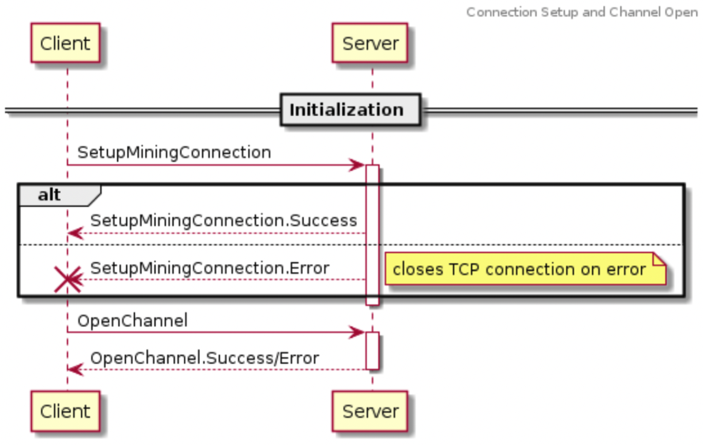
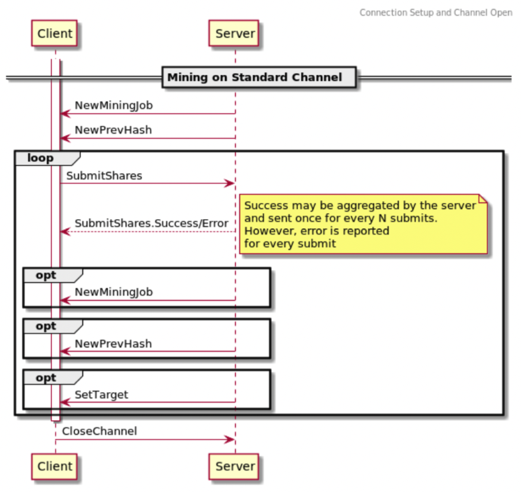

# 5. Mining Protocol

The Mining Protocol is used to distribute work to Mining Devices, and it's also how they submit their proof of work.

It can be used without Job Declaration and Template Distribution Protocols, where a subset of the messages are used by a pool to unilaterally distribute work to miners.

Alternatively, it can be used in conjunction with Job Declaration and Template Distribution Protocols, where both pool and miners coordinate to decide what is valid work.

## 5.1 Channels

The protocol is designed such that downstream devices (or proxies) open communication channels with upstream stratum nodes within established connections.
The upstream stratum endpoints could be actual mining servers or proxies that pass the messages further upstream.
Each channel identifies a dedicated mining session associated with an authorized user.
Upstream stratum nodes accept work submissions and specify a mining target on a per-channel basis.

There can theoretically be up to 2^32 open channels within one physical connection to an upstream stratum node.
All channels are independent of each other, but share some messages broadcast from the server for higher efficiency (e.g. information about a new prevhash).
Each channel is identified by its `channel_id` (`U32`), which is consistent throughout the whole life of the connection.

A proxy can either transparently allow its clients to open separate channels with the server (preferred behavior) or aggregate open connections from downstream devices into its own open channel with the server and translate the messages accordingly (present mainly for allowing v1 proxies).
Both options have some practical use cases.
In either case, proxies SHOULD aggregate clients' channels into a smaller number of TCP connections.
This saves network traffic for broadcast messages sent by a server because fewer messages need to be sent in total, which leads to lower latencies as a result.
And it further increases efficiency by allowing larger packets to be sent.

The protocol defines three types of channels: **standard channels**, **extended channels** (mining sessions) and **group channels** (organizational), which are useful for different purposes.

The main difference between standard and extended channels is that standard channels cannot manipulate the coinbase transaction / Merkle path, as they operate solely on provided Merkle roots.
We call this header-only mining.
Extended channels, on the other hand, are given extensive control over the search space so that they can implement various advanced use cases such as translation between v1 and v2 protocols, difficulty aggregation, custom search space splitting, etc.

This separation vastly simplifies the protocol implementation for clients that don’t support extended channels, as they only need to implement the subset of protocol messages related to standard channels (see Mining Protocol Messages for details).

### 5.1.1 Standard Channels

Standard channels are intended to be used by end mining devices.

The size of the search space for one standard channel (header-only mining) for one particular value in the `nTime` field is `2^(NONCE_BITS + VERSION_ROLLING_BITS) = ~280Th`, where `NONCE_BITS = 32` and `VERSION_ROLLING_BITS = 16`.
This is a guaranteed space before `nTime` rolling (or changing the Merkle root).

The protocol dedicates all directly modifiable bits (`version`, `nonce`, and `nTime`) from the block header to one mining channel.
This is the smallest assignable unit of search space by the protocol.
The client which opened the particular channel owns the whole assigned space and can split it further if necessary (e.g. for multiple hashing boards and for individual chips etc.).

### 5.1.2 Extended Channels

Extended channels are intended to be used by proxies.
Upstream servers which accept connections and provide work MUST support extended channels.
Clients, on the other hand, do not have to support extended channels, as they MAY be implemented more simply with only standard channels at the end-device level.
Thus, upstream servers providing work MUST also support standard channels.

The size of search space for an extended channel is `2^(NONCE_BITS+VERSION_ROLLING_BITS+extranonce_size*8)` per `nTime` value.

### 5.1.3 Group Channels

Standard channels opened within one particular connection can be grouped together to be addressable by a common communication group channel.

Whenever a standard channel is created it is always put into some channel group identified by its `group_channel_id`.
Group channel ID namespace is the same as channel ID namespace on a particular connection but the values chosen for group channel IDs must be distinct.

### 5.1.4 Future Jobs

An empty future block job or speculated non-empty job can be sent in advance to speedup new mining job distribution.
The point is that the mining server MAY have precomputed such a job and is able to pre-distribute it for all active channels.
The only missing information to start to mine on the new block is the new prevhash.
This information can be provided independently.

Such an approach improves the efficiency of the protocol where the upstream node does not waste precious time immediately after a new block is found in the network.

To specify that a job is for a future prevhash, the job's `min_ntime` field is left empty.

## 5.2 Hashing Space Distribution

Each mining device has to work on a unique part of the whole search space.
The full search space is defined in part by valid values in the following block header fields:

- Nonce header field (32 bits)
- Version header field (16 bits, as specified by [BIP 320](https://github.com/bitcoin/bips/blob/master/bip-0320.mediawiki))
- Timestamp header field

The other portion of the block header that’s used to define the full search space is the Merkle root hash of all transactions in the block, projected to the last variable field in the block header:

- Merkle root, deterministically computed from:
  - Coinbase transaction: typically 4-8 bytes, possibly much more.
  - Transaction set: practically unbounded space.
    All roles in Stratum v2 MUST NOT use transaction selection/ordering for additional hash space extension.
    This stems both from the concept that miners/pools should be able to choose their transaction set freely without any interference with the protocol, and also to enable future protocol modifications to Bitcoin.
    In other words, any rules imposed on transaction selection/ordering by miners not described in the rest of this document may result in invalid work/blocks.

Mining servers MUST assign a unique subset of the search space to each connection/channel (and therefore each mining device) frequently and rapidly enough so that the mining devices are not running out of search space.
Unique jobs can be generated regularly by:

- Putting unique data into the coinbase for each connection/channel, and/or
- Using unique work from a work provider, e.g. a previous work update (note that this is likely more difficult to implement, especially in light of the requirement that transaction selection/ordering not be used explicitly for additional hash space distribution).

This protocol explicitly expects that upstream server software is able to manage the size of the hashing space correctly for its clients and can provide new jobs quickly enough.

## 5.3 Mining Protocol Messages

  
Figure 4.3.a Mining Protocol Messages: Initialization

  
Figure 4.3.b Mining Protocol Messages: Mining on Standard Channel

### 5.3.1 `SetupConnection` Flags for Mining Protocol

Flags usable in `SetupConnection.flags` and `SetupConnection.Error::flags`, where bit 0 is the least significant bit of the u32 type:

| Field Name               | Bit | Description                                                                         |
| ------------------------ | --- | ----------------------------------------------------------------------------------- |
| REQUIRES_STANDARD_JOBS   | 0   | The downstream node requires standard jobs. It does not understand group channels - |
|                          |     | it is unable to process extended jobs sent to standard channels through a group     |
|                          |     | channel.                                                                            |
| REQUIRES_WORK_SELECTION  | 1   | If set to 1, the client notifies the server that it will send SetCustomMiningJob on |
|                          |     | this connection                                                                     |
| REQUIRES_VERSION_ROLLING | 2   | The client requires version rolling for efficiency or correct operation and the     |
|                          |     | server MUST NOT send jobs which do not allow version rolling                        |

Flags usable in `SetupConnection.Success.flags`:
| Field Name | Bit | Description |
|----------------------------|-----|-----------------------------------------------------------------------------------|
| REQUIRES_FIXED_VERSION | 0 | Upstream node will not accept any changes to the version field. Note that if |
| | | REQUIRES_VERSION_ROLLING was set in the SetupConnection::flags field, this bit |
| | | MUST NOT be set. Further, if this bit is set, extended jobs MUST NOT indicate |
| | | support for version rolling. |
| REQUIRES_EXTENDED_CHANNELS | 1 | Upstream node will not accept opening of a standard channel |

### 5.3.2 `OpenStandardMiningChannel` (Client -> Server)

This message requests to open a standard channel to the upstream node.

After receiving a `SetupConnection.Success` message, the client SHOULD respond by opening channels on the connection.
If no channels are opened within a reasonable period the server SHOULD close the connection for inactivity.

Every client SHOULD start its communication with an upstream node by opening a channel, which is necessary for almost all later communication.
The upstream node either passes opening the channel further or has enough local information to handle channel opening on its own (this is mainly intended for v1 proxies).
Clients must also communicate information about their hashing power in order to receive well-calibrated job assignments.

| Field Name        | Data Type | Description                                                                                                                                                                                                                                                                                                                  |
| ----------------- | --------- | ---------------------------------------------------------------------------------------------------------------------------------------------------------------------------------------------------------------------------------------------------------------------------------------------------------------------------- |
| request_id        | U32       | Client-specified identifier for matching responses from upstream server. The value MUST be connection-wide unique and is not interpreted by the server.                                                                                                                                                                      |
| user_identity     | STR0_255  | Unconstrained sequence of bytes. Whatever is needed by upstream node to identify/authenticate the client, e.g. "braiinstest.worker1". Additional restrictions can be imposed by the upstream node (e.g. a pool). It is highly recommended that UTF-8 encoding is used.                                                       |
| nominal_hash_rate | F32       | [h/s] Expected hashrate of the device (or cumulative hashrate on the channel if multiple devices are connected downstream) in h/s. Depending on server's target setting policy, this value can be used for setting a reasonable target for the channel. Proxy MUST send 0.0f when there are no mining devices connected yet. |
| max_target        | U256      | Maximum target which can be accepted by the connected device or devices. Server MUST accept the target or respond by sending OpenMiningChannel.Error message.                                                                                                                                                                |

### 5.3.3 `OpenStandardMiningChannel.Success` (Server -> Client)

Sent as a response for opening a standard channel, if successful.

| Field Name        | Data Type | Description                                                                                                                                                                    |
| ----------------- | --------- | ------------------------------------------------------------------------------------------------------------------------------------------------------------------------------ |
| request_id        | U32       | Client-specified request ID from OpenStandardMiningChannel message, so that the client can pair responses with open channel requests                                           |
| channel_id        | U32       | Newly assigned identifier of the channel, stable for the whole lifetime of the connection, e.g. it is used for broadcasting new jobs by NewExtendedMiningJob                   |
| target            | U256      | Initial target for the mining channel                                                                                                                                          |
| extranonce_prefix | B0_32     | Bytes used as implicit first part of extranonce for the scenario when extended job is served by the upstream node for a set of standard channels that belong to the same group |
| group_channel_id  | U32       | Group channel into which the new channel belongs. See SetGroupChannel for details.                                                                                             |

### 5.3.4 `OpenExtendedMiningChannel` (Client -> Server)

Similar to [5.3.2 `OpenStandardMiningChannel`](#532-openstandardminingchannel-client---server), but requests to open an extended channel instead of standard channel.

| Field Name                                    | Data Type | Description                                           |
| --------------------------------------------- | --------- | ----------------------------------------------------- |
| `<All fields from OpenStandardMiningChannel>` |
| min_extranonce_size                           | U16       | Minimum size of extranonce needed by the device/node. |

### 5.3.5 `OpenExtendedMiningChannel.Success` (Server -> Client)

Sent as a response for opening an extended channel.

| Field Name        | Data Type | Description                                                                                                                                                  |
| ----------------- | --------- | ------------------------------------------------------------------------------------------------------------------------------------------------------------ |
| request_id        | U32       | Client-specified request ID from OpenExtendedMiningChannel message, so that the client can pair responses with open channel requests                         |
| channel_id        | U32       | Newly assigned identifier of the channel, stable for the whole lifetime of the connection, e.g. it is used for broadcasting new jobs by NewExtendedMiningJob |
| target            | U256      | Initial target for the mining channel                                                                                                                        |
| extranonce_size   | U16       | Extranonce size (in bytes) set for the channel                                                                                                               |
| extranonce_prefix | B0_32     | Bytes used as implicit first part of extranonce                                                                                                              |

### 5.3.6 `OpenMiningChannel.Error` (Server -> Client)

| Field Name | Data Type | Description                                                 |
| ---------- | --------- | ----------------------------------------------------------- |
| request_id | U32       | Client-specified request ID from OpenMiningChannel message  |
| error_code | STR0_255  | Human-readable error code(s), see Error Codes section below |

Possible error codes:

- `unknown-user`
- `max-target-out-of-range`

### 5.3.7 `UpdateChannel` (Client -> Server)

Client notifies the server about changes on the specified channel.
If a client performs device/connection aggregation (i.e. it is a proxy), it MUST send this message when downstream channels change.
This update can be debounced so that it is not sent more often than once in a second (for a very busy proxy).

| Field Name        | Data Type | Description                                                                                                                                                                                                                           |
| ----------------- | --------- | ------------------------------------------------------------------------------------------------------------------------------------------------------------------------------------------------------------------------------------- |
| channel_id        | U32       | Channel identification                                                                                                                                                                                                                |
| nominal_hash_rate | F32       | See Open\*Channel for details                                                                                                                                                                                                         |
| maximum_target    | U256      | Maximum target is changed by server by sending SetTarget. This field is understood as device's request. There can be some delay between UpdateChannel and corresponding SetTarget messages, based on new job readiness on the server. |

When `maximum_target` is smaller than currently used maximum target for the channel, upstream node MUST reflect the client’s request (and send appropriate `SetTarget` message).

### 5.3.8 `UpdateChannel.Error` (Server -> Client)

Sent only when `UpdateChannel` message is invalid. When it is accepted by the server, no response is sent back.

| Field Name | Data Type | Description                                                 |
| ---------- | --------- | ----------------------------------------------------------- |
| channel_id | U32       | Channel identification                                      |
| error_code | STR0_255  | Human-readable error code(s), see Error Codes section below |

Possible error codes:

- `max-target-out-of-range`
- `invalid-channel-id`

### 5.3.9 `CloseChannel` (Client -> Server, Server -> Client)

Client sends this message when it ends its operation.
The server MUST stop sending messages for the channel.
A proxy MUST send this message on behalf of all opened channels from a downstream connection in case of downstream connection closure.

| Field Name  | Data Type | Description                    |
| ----------- | --------- | ------------------------------ |
| channel_id  | U32       | Channel identification         |
| reason_code | STR0_255  | Reason for closing the channel |

If a proxy is operating in channel aggregating mode (translating downstream channels into aggregated extended upstream channels), it MUST send an `UpdateChannel` message when it receives `CloseChannel` or connection closure from a downstream connection.
In general, proxy servers MUST keep the upstream node notified about the real state of the downstream channels.

### 5.3.10 `SetExtranoncePrefix` (Server -> Client)

Changes downstream node’s extranonce prefix.
It is applicable for all jobs sent after this message on a given channel (both jobs provided by the upstream or jobs introduced by `SetCustomMiningJob` message).
This message is applicable only for explicitly opened extended channels or standard channels (not group channels).

| Field Name        | Data Type | Description                                     |
| ----------------- | --------- | ----------------------------------------------- |
| channel_id        | U32       | Extended or standard channel identifier         |
| extranonce_prefix | B0_32     | Bytes used as implicit first part of extranonce |

### 5.3.11 `SubmitSharesStandard` (Client -> Server)

Client sends result of its hashing work to the server.

| Field Name      | Data Type | Description                                                                                                                                                                                                                                    |
| --------------- | --------- | ---------------------------------------------------------------------------------------------------------------------------------------------------------------------------------------------------------------------------------------------- |
| channel_id      | U32       | Channel identification                                                                                                                                                                                                                         |
| sequence_number | U32       | Unique sequential identifier of the submit within the channel                                                                                                                                                                                  |
| job_id          | U32       | Identifier of the job as provided by NewMiningJob or NewExtendedMiningJob message                                                                                                                                                              |
| nonce           | U32       | Nonce leading to the hash being submitted                                                                                                                                                                                                      |
| ntime           | U32       | The nTime field in the block header. This MUST be greater than or equal to the header_timestamp field in the latest SetNewPrevHash message and lower than or equal to that value plus the number of seconds since the receipt of that message. |
| version         | U32       | Full nVersion field                                                                                                                                                                                                                            |

### 5.3.12 `SubmitSharesExtended` (Client -> Server)

Only relevant for extended channels.
The message is the same as `SubmitShares`, with the following additional field:

| Field Name                              | Data Type | Description                                                                                                                                                                                                                                                                                |
| --------------------------------------- | --------- | ------------------------------------------------------------------------------------------------------------------------------------------------------------------------------------------------------------------------------------------------------------------------------------------ |
| `<SubmitSharesStandard message fields>` |
| extranonce                              | B0_32     | Extranonce bytes which need to be added to coinbase to form a fully valid submission (full coinbase = coinbase_tx_prefix + extranonce_prefix + extranonce + coinbase_tx_suffix). The size of the provided extranonce MUST be equal to the negotiated extranonce size from channel opening. |

### 5.3.13 `SubmitShares.Success` (Server -> Client)

Response to `SubmitShares` or `SubmitSharesExtended`, accepting results from the miner.
Because it is a common case that shares submission is successful, this response can be provided for multiple `SubmitShare` messages aggregated together.

| Field Name                 | Data Type | Description                                         |
| -------------------------- | --------- | --------------------------------------------------- |
| channel_id                 | U32       | Channel identification                              |
| last_sequence_number       | U32       | Most recent sequence number with a correct result   |
| new_submits_accepted_count | U32       | Count of new submits acknowledged within this batch |
| new_shares_sum             | U64       | Sum of shares acknowledged within this batch        |

The server does not have to double check that the sequence numbers sent by a client are actually increasing.
It can simply use the last one received when sending a response.
It is the client’s responsibility to keep the sequence numbers correct/useful.

### 5.3.14 `SubmitShares.Error` (Server -> Client)

An error is immediately submitted for every incorrect submit attempt.
In case the server is not able to immediately validate the submission, the error is sent as soon as the result is known.
This delayed validation can occur when a miner gets faster updates about a new prevhash than the server does (see `NewPrevHash` message for details).

| Field Name      | Data Type | Description                                                 |
| --------------- | --------- | ----------------------------------------------------------- |
| channel_id      | U32       | Channel identifier                                          |
| sequence_number | U32       | Submission sequence number for which this error is returned |
| error_code      | STR0_255  | Human-readable error code(s), see Error Codes section below |

Possible error codes:

- `invalid-channel-id`
- `stale-share`
- `difficulty-too-low`
- `invalid-job-id`

### 5.3.15 `NewMiningJob` (Server -> Client)

The server provides an updated mining job to the client through a standard channel. This MUST be the first message after the channel has been successfully opened. This first message will have min_ntime unset (future job).

If the `min_ntime` field is set, the client MUST start to mine on the new job immediately after receiving this message, and use the value for the initial nTime.

| Field Name  | Data Type   | Description                                                                                                                                                                                                                                                                                                                                                                                                                                                                         |
| ----------- | ----------- | ----------------------------------------------------------------------------------------------------------------------------------------------------------------------------------------------------------------------------------------------------------------------------------------------------------------------------------------------------------------------------------------------------------------------------------------------------------------------------------- |
| channel_id  | U32         | Channel identifier, this must be a standard channel                                                                                                                                                                                                                                                                                                                                                                                                                                 |
| job_id      | U32         | Identifier of the job as provided by NewMiningJob or NewExtendedMiningJob message                                                                                                                                                                                                                                                                                                                                                                                                   |
| min_ntime   | OPTION[u32] | Smallest nTime value available for hashing for the new mining job. An empty value indicates this is a future job to be activated once a SetNewPrevHash message is received with a matching job_id. This SetNewPrevHash message provides the new prev_hash and min_ntime. If the min_ntime value is set, this mining job is active and miner must start mining on it immediately. In this case, the new mining job uses the prev_hash from the last received SetNewPrevHash message. |
| version     | U32         | Valid version field that reflects the current network consensus. The general purpose bits (as specified in BIP320) can be freely manipulated by the downstream node. The downstream node MUST NOT rely on the upstream node to set the BIP320 bits to any particular value.                                                                                                                                                                                                         |
| merkle_root | B32         | Merkle root field as used in the bitcoin block header                                                                                                                                                                                                                                                                                                                                                                                                                               |

### 5.3.16 `NewExtendedMiningJob` (Server -> Client)

(Extended and group channels only)

For an **extended channel**:
The whole search space of the job is owned by the specified channel.
If the `min_ntime` field is set to some nTime, the client MUST start to mine on the new job as soon as possible after receiving this message.

For a **group channel**:
This is a broadcast variant of `NewMiningJob` message with the `merkle_root` field replaced by `merkle_path` and coinbase transaction prefix and suffix, for further traffic optimization.
The Merkle root is then defined deterministically for each channel by the common `merkle_path` and unique `extranonce_prefix` serialized into the coinbase.
The full coinbase is then constructed as follows: `coinbase_tx_prefix + extranonce_prefix + coinbase_tx_suffix`.

The proxy MAY transform this multicast variant for downstream standard channels into `NewMiningJob` messages by computing the derived Merkle root for them.
A proxy MUST translate the message for all downstream channels belonging to the group which don’t signal that they accept extended mining jobs in the `SetupConnection` message (intended and expected behavior for end mining devices).

| Field Name              | Data Type      | Description                                                                                                                                                                                                                                                                                                                                                                                                                                                                                      |
| ----------------------- | -------------- | ------------------------------------------------------------------------------------------------------------------------------------------------------------------------------------------------------------------------------------------------------------------------------------------------------------------------------------------------------------------------------------------------------------------------------------------------------------------------------------------------ |
| channel_id              | U32            | For a group channel, the message is broadcasted to all standard channels belonging to the group. Otherwise, it is addressed to the specified extended channel.                                                                                                                                                                                                                                                                                                                                   |
| job_id                  | U32            | Server’s identification of the mining job                                                                                                                                                                                                                                                                                                                                                                                                                                                        |
| min_ntime               | OPTION[u32]    | Smallest nTime value available for hashing for the new mining job. An empty value indicates this is a future job to be activated once a SetNewPrevHash message is received with a matching job_id. This SetNewPrevHash message provides the new prev_hash and min_ntime. If the min_ntime value is set, this mining job is active and miner must start mining on it immediately. In this case, the new mining job uses the prev_hash from the last received SetNewPrevHash message. immediately. |
| version                 | U32            | Valid version field that reflects the current network consensus                                                                                                                                                                                                                                                                                                                                                                                                                                  |
| version_rolling_allowed | BOOL           | If set to True, the general purpose bits of version (as specified in BIP320) can be freely manipulated by the downstream node. The downstream node MUST NOT rely on the upstream node to set the BIP320 bits to any particular value. If set to False, the downstream node MUST use version as it is defined by this message.                                                                                                                                                                    |
| merkle_path             | SEQ0_255[U256] | Merkle path hashes ordered from deepest                                                                                                                                                                                                                                                                                                                                                                                                                                                          |
| coinbase_tx_prefix      | B0_64K         | Prefix part of the coinbase transaction\*                                                                                                                                                                                                                                                                                                                                                                                                                                                        |
| coinbase_tx_suffix      | B0_64K         | Suffix part of the coinbase transaction                                                                                                                                                                                                                                                                                                                                                                                                                                                          |

\*The full coinbase is constructed by inserting one of the following:

- For a **standard channel**: `extranonce_prefix`
- For an **extended channel**: `extranonce_prefix + extranonce (=N bytes)`, where `N` is the negotiated extranonce space for the channel (`OpenMiningChannel.Success.extranonce_size`)

### 5.3.17 `SetNewPrevHash` (Server -> Client, broadcast)

Prevhash is distributed whenever a new block is detected in the network by an upstream node or when a new downstream opens a channel.

This message MAY be shared by all downstream nodes (sent only once to each channel group).
Clients MUST immediately start to mine on the provided prevhash.
When a client receives this message, only the job referenced by Job ID is valid.
The remaining jobs already queued by the client have to be made invalid.

Note: There is no need for block height in this message.

| Field Name | Data Type | Description                                                                                                                                                                                                                                                                |
| ---------- | --------- | -------------------------------------------------------------------------------------------------------------------------------------------------------------------------------------------------------------------------------------------------------------------------- |
| channel_id | U32       | Group channel or channel that this prevhash is valid for                                                                                                                                                                                                                   |
| job_id     | U32       | ID of a job that is to be used for mining with this prevhash. A pool may have provided multiple jobs for the next block height (e.g. an empty block or a block with transactions that are complementary to the set of transactions present in the current block template). |
| prev_hash  | U256      | Previous block’s hash, block header field                                                                                                                                                                                                                                  |
| min_ntime  | U32       | Smallest nTime value available for hashing                                                                                                                                                                                                                                 |
| nbits      | U32       | Block header field                                                                                                                                                                                                                                                         |

### 5.3.18 `SetCustomMiningJob` (Client -> Server)

Can be sent only on extended channel.
`SetupConnection.flags` MUST contain `REQUIRES_WORK_SELECTION` flag (work selection feature successfully declared).

The downstream node has a custom job declared by a trusted external Job Declarator.
The `mining_job_token` provides the information for the pool to authorize the custom job that has been or will be declared between the Job Declarator and Pool.

| Field Name                  | Data Type      | Description                                                                                                                                                           |
| --------------------------- | -------------- | --------------------------------------------------------------------------------------------------------------------------------------------------------------------- |
| channel_id                  | U32            | Extended channel identifier                                                                                                                                           |
| request_id                  | U32            | Client-specified identifier for pairing responses                                                                                                                     |
| mining_job_token            | B0_255         | Token provided by the pool which uniquely identifies the job that the Job Declarator has declared with the pool. See the Job Declaration Protocol for more details. |
| version                     | U32            | Valid version field that reflects the current network consensus. The general purpose bits (as specified in BIP320) can be freely manipulated by the downstream node.  |
| prev_hash                   | U256           | Previous block’s hash, found in the block header field                                                                                                                |
| min_ntime                   | U32            | Smallest nTime value available for hashing                                                                                                                            |
| nbits                       | U32            | Block header field                                                                                                                                                    |
| coinbase_tx_version         | U32            | The coinbase transaction nVersion field                                                                                                                               |
| coinbase_prefix             | B0_255         | Up to 8 bytes (not including the length byte) which are to be placed at the beginning of the coinbase field in the coinbase transaction.                              |
| coinbase_tx_input_nSequence | U32            | The coinbase transaction input's nSequence field                                                                                                                      |
| coinbase_tx_value_remaining | U64            | The value, in satoshis, available for spending in coinbase outputs added by the client. Includes both transaction fees and block subsidy.                             |
| coinbase_tx_outputs         | B0_64K         | Bitcoin transaction outputs to be included as the last outputs in the coinbase transaction                                                                            |
| coinbase_tx_locktime        | U32            | The locktime field in the coinbase transaction                                                                                                                        |
| merkle_path                 | SEQ0_255[U256] | Merkle path hashes ordered from deepest                                                                                                                               |
| extranonce_size             | U16            | Size of extranonce in bytes that will be provided by the downstream node                                                                                              |
| min_ntime                   | OPTION[u32]    | TBD: Can custom job ever be future?                                                                                                                                   |

### 5.3.19 `SetCustomMiningJob.Success` (Server -> Client)

Response from the server when it accepts the custom mining job.
Client can start to mine on the job immediately (by using the `job_id` provided within this response).

| Field Name         | Data Type | Description                                                               |
| ------------------ | --------- | ------------------------------------------------------------------------- |
| channel_id         | U32       | Extended channel identifier                                               |
| request_id         | U32       | Client-specified identifier for pairing responses. Value from the request |
|                    |           | MUST be provided by upstream in the response message.                     |
| job_id             | U32       | Server’s identification of the mining job                                 |

\*The full coinbase is constructed by inserting one of the following:

- For a **standard channel**: `extranonce_prefix`
- For an **extended channel**: `extranonce_prefix + extranonce (=N bytes)`, where `N` is the negotiated extranonce space for the channel (`OpenMiningChannel.Success.extranonce_size`)

### 5.3.20 `SetCustomMiningJob.Error` (Server -> Client)

| Field Name | Data Type | Description                                                                                                                     |
| ---------- | --------- | ------------------------------------------------------------------------------------------------------------------------------- |
| channel_id | U32       | Extended channel identifier                                                                                                     |
| request_id | U32       | Client-specified identifier for pairing responses. Value from the request MUST be provided by upstream in the response message. |
| error_code | STR0_255  | Reason why the custom job has been rejected                                                                                     |

Possible errors:

- `invalid-channel-id`
- `invalid-mining-job-token`
- `invalid-job-param-value-{}` - `{}` is replaced by a particular field name from `SetCustomMiningJob` message

### 5.3.21 `SetTarget` (Server -> Client)

The server controls the submission rate by adjusting the difficulty target on a specified channel.
All submits leading to hashes higher than the specified target will be rejected by the server.

Maximum target is valid until the next `SetTarget` message is sent and is applicable for all jobs received on the channel in the future or already received with an empty `min_ntime`.
The message is not applicable for already received jobs with `min_ntime=nTime`, as their maximum target remains stable.

| Field Name     | Data Type | Description                                                                       |
| -------------- | --------- | --------------------------------------------------------------------------------- |
| channel_id     | U32       | Channel identifier                                                                |
| maximum_target | U256      | Maximum value of produced hash that will be accepted by a server to accept shares |

When `SetTarget` is sent to a group channel, the maximum target is applicable to all channels in the group.

### 5.3.22 `SetGroupChannel` (Server -> Client)

Every standard channel is a member of a group of standard channels, addressed by the upstream server's provided identifier.
The group channel is used mainly for efficient job distribution to multiple standard channels at once.

If we want to allow different jobs to be served to different standard channels (e.g. because of different [BIP 8](https://github.com/bitcoin/bips/blob/master/bip-0008.mediawiki) version bits) and still be able to distribute the work by sending `NewExtendendedMiningJob` instead of a repeated `NewMiningJob`, we need a more fine-grained grouping for standard channels.

This message associates a set of standard channels with a group channel.
A channel (identified by particular ID) becomes a group channel when it is used by this message as `group_channel_id`.
The server MUST ensure that a group channel has a unique channel ID within one connection. Channel reinterpretation is not allowed.

This message can be sent only to connections that don’t have `REQUIRES_STANDARD_JOBS` flag in `SetupConnection`.

| Field Name       | Data Type     | Description                                                                               |
| ---------------- | ------------- | ----------------------------------------------------------------------------------------- |
| group_channel_id | U32           | Identifier of the group where the standard channel belongs                                |
| channel_ids      | SEQ0_64K[U32] | A sequence of opened standard channel IDs, for which the group channel is being redefined |
