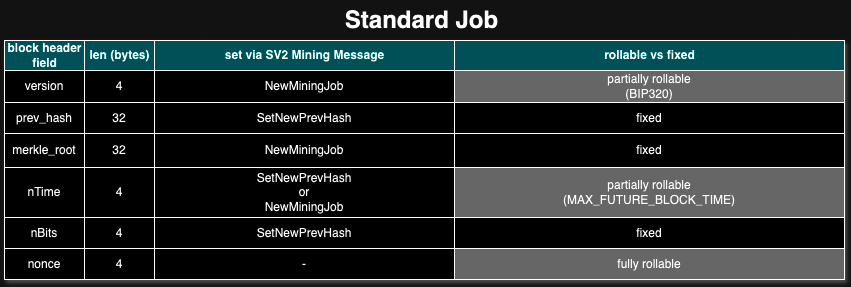
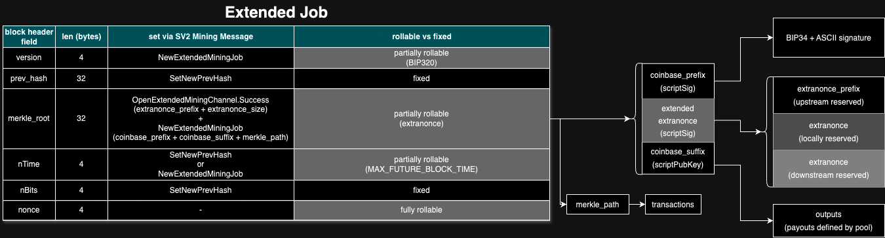
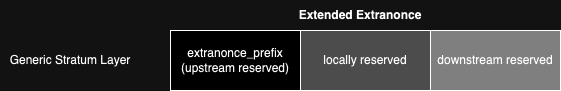
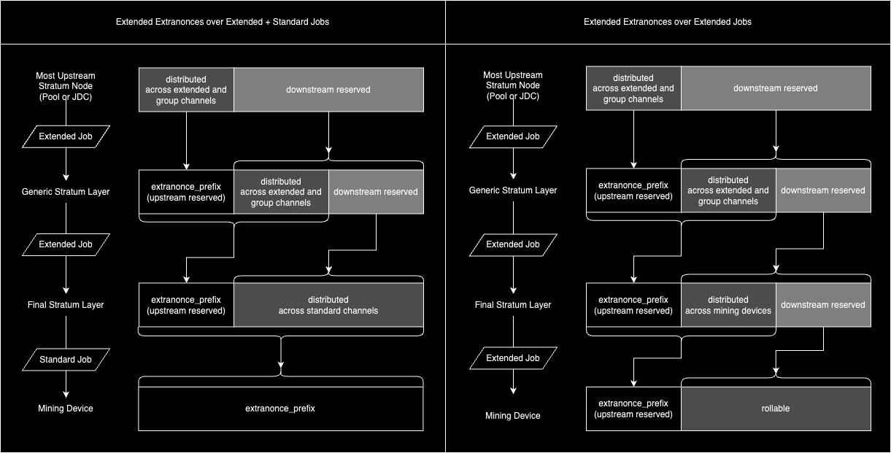

# 5. Mining Protocol

The Mining Protocol enables the distribution of work to mining devices and the submission of proof-of-work results.

It can be used without Job Declaration and Template Distribution Protocols, where a subset of the messages are used by a pool to unilaterally distribute work to miners.

Alternatively, it can be used in conjunction with Job Declaration and Template Distribution Protocols, where both pool and miners coordinate to decide what is valid work.

## 5.1 Job

A **Job** consists of a unit of work containing all the necessary information about the hashing space over some candidate block header.

Each Mining Device has to work on a unique part of the whole search space.
The full search space is defined in part by valid values in the following block header fields:

- `nonce` header field (32 bits)
- `version` header field (16 bits, as specified by [BIP 320](https://github.com/bitcoin/bips/blob/master/bip-0320.mediawiki))
- `nTime` header field (32 bits timestamp, limited under [`MAX_FUTURE_BLOCK_TIME`](https://github.com/bitcoin/bitcoin/blob/28ce159bc327e6dfec34077ff2e379b23a95db65/src/chain.h#L29))

The other portion of the block header that is used to define the full search space is the Merkle Root, which is deterministically computed from:
- Coinbase transaction
- Transaction set

All roles in Stratum v2 MUST NOT use transaction selection/ordering for additional hash space extension.
This stems both from the concept that miners/pools should be able to choose their transaction set freely without any interference with the protocol, and also to enable future protocol modifications to Bitcoin.
In other words, any rules imposed on transaction selection/ordering by miners not described in the rest of this document may result in invalid work.

Mining servers MUST assign a unique subset of the search space to each mining device, otherwise the mining devices will waste energy with overlapping search.

This protocol explicitly expects that upstream server software is able to manage the size of the hashing space correctly for its clients and can provide new and unique Jobs quickly enough, based on the hashpower of each client.

The protocol defines two main types of Jobs: **Standard Job** and **Extended Job**.

This separation vastly simplifies the protocol implementation for clients that don’t support Extended Job, as they only need to implement the subset of protocol messages related to Standard Job (see Mining Protocol Messages for details).

Additionally, a Job (either Standard or Extended) also could be potentially labeled as a **Future Job** and/or **Custom Job**.

### 5.1.1 Standard Job

Standard Jobs are restricted to fixed Merkle Roots, where the only modifiable bits are under the `version`, `nonce`, and `nTime` fields of the block header.

We call this header-only mining (HOM), and it is the smallest assignable unit of search space by the protocol.

The size of the search space for one Standard Job, given a fixed `nTime` field, is `2^(NONCE_BITS + BIP320_VERSION_ROLLING_BITS) = ~280Th`, where `NONCE_BITS = 32` and `BIP320_VERSION_ROLLING_BITS = 16`.
This is a guaranteed space before `nTime` rolling (or changing the Merkle Root by sending a new Job).

Standard Jobs are distributed via the [`NewMiningJob`](#5315-newminingjob-server---client) message, which can ONLY be sent via [Standard Channels](#521-standard-channels).

Note that Mining Devices with hashrate above 280 TH/s will outrun the true time when rolling the `nTime` field. This is not necessarily a problem, as long as the Job remains valid within the limits defined by the `MAX_FUTURE_BLOCK_TIME` constant of the Bitcoin protocol (2 hours).

Depending on the hashrate of the Mining Device, it must receive new Standard Jobs (with a different Merkle Root) frequently enough in order to avoid rolling `nTime` too much ahead of the true time (which could result in rejected work).



### 5.1.2 Extended Job

Extended Jobs allow rolling Merkle Roots, giving extensive control over the search space so that they can implement various advanced use cases such as:
- translation between Sv1 and Sv2 protocols
- difficulty aggregation
- search space splitting

Extended Jobs are distributed via the [`NewExtendedMiningJob`](#5416-newextendedminingjob-server---client) message, which can be sent via:
- [Group Channels](#523-group-channels)
- [Extended Channels](#522-extended-channels)



#### 5.1.2.1 Extended Extranonce

Downstream and Upstream are relative terms. There could theoretically be multiple nested layers of Stratum Nodes (e.g.: Proxies) between a Work-Providing Node and a Mining Device.

So the protocol establishes the notion of **Extended Extranonce**, which is a fundamental component of Extended Jobs.

The Extended Extranonce is an array of bytes, split into three different areas:



- The `extranonce_prefix` bytes are reserved for the upstream layer, where fixed bytes were already established for the Extranonce and are no longer available for rolling or search space splitting.
- The **locally reserved** bytes is where the local layer will assign unique values for its own downstream clients, according to their hashpower.
- The **downstream reserved** bytes is where the downstream clients will further distribute the search space, or use for rolling (if they are Mining Devices).



In order to calculate the Merkle Root, an Extended Job carries the following data:
- `merkle_path`
- `coinbase_tx_prefix`
- `coinbase_tx_suffix`

An [Extended Channel](#532-extended-channels) has the following properties:
- `extranonce_prefix`: the Extended Extranonce bytes that were already allocated by the upstream server.
- `extranonce_size`: how many bytes are available for the locally reserved and downstream reserved areas of the Extended Extranonce.

And a [Standard Channel](#531-standard-channels) has the following property:
- `extranonce_prefix` the Extended Extranonce bytes that were already allocated by the upstream server.

So when some layer receives an Extended Job, it could either:
- propagate it as an Extended Job to a downstream Extended or Group Channel (via `NewExtendedMiningJob` notification), where the Extended Extranonce will be further split.
- convert it into multiple Standard Job notifications (`NewMiningJob`), where each downstream Standard Channel's `extranonce_prefix` is combined with `coinbase_tx_prefix` + `coinbase_tx_suffix`.

For conversion into Standard Jobs, the Coinbase Transaction is constructed by concatenating these fields in this specific order: `coinbase_tx_prefix + extranonce_prefix + coinbase_tx_suffix`.

The Coinbase Transaction is then combined with the `merkle_path` of the Extended Job to calculate the `merkle_root` for the Standard Job notification (`NewMiningJob`). Since Standard Jobs are HOM, there's no `extranonce_size` field on the Standard Job notification.

In case of an Extended Job broadcast to a Group Channel, its `coinbase_tx_prefix` carries the transaction field `scriptSig length`. It follows that every Standard and/or Extended Channel that belongs to the same Group Channel MUST have the exact same full Extended Extranonce size, because the coinbase transaction they are working on MUST have the same `scriptSig length` that is broadcast to the Group Channel.

### 5.1.3 Future Job

A Job with an empty template or speculated non-empty template can be sent in advance to speedup Job distribution when a new block is found on the network.

The mining server MAY have precomputed such a Job and is able to pre-distribute it for all active Channels.
The only missing information to start to mine on the new block is the new `prev_hash`.
This information can be provided independently.

Such an approach improves the efficiency of the protocol where the upstream node does not waste precious time immediately after a new block is found in the network.

The trade-off here is that a non-empty Future Job could potentially contain a transaction that was already included in the block that was just propagated on the network, which would lead to an invalid block if successfully mined.

So mining servers that provide non-empty Future Jobs SHOULD:
- never send a `SetNewPrevHash` for a Future Job that was later found to contain a conflicting transaction.
- minimize the probability of Future Jobs containing conflicting transactions (which leads to Future Jobs carrying less profitable templates).
- after a `SetNewPrevHash` is propagated for a Future Job, provide a non-Future Job for this same `prev_hash` as fast as possible (with a more profitable template).

### 5.1.4 Custom Job

A Custom Job contains a set of transactions that were chosen by the miner instead of being unilaterally imposed by the Pool.

Under the Job Declaration Protocol, upon request the Job Declarator Server (JDS) sends a `mining_job_token` to the Job Declarator Client.

This `mining_job_token` is used by JDC for:
- declaring a Custom Job to JDS (via `DeclareMiningJob` message of Job Declaration Protocol)
- notifying Pool about a Custom Job (via `SetCustomMiningJob` message of Mining Protocol)

This is a key feature of Stratum V2 that improves Bitcoin decentralization. Please see Job Declaration Protocol for more details.

## 5.2 Channel

The Mining Protocol is designed such that downstream Mining Devices open Channels with upstream Stratum Nodes within established Connections.
These upstream Stratum Nodes could be actual Work-Providing Nodes (e.g.: Pool, or Job Declarator Client) or simply Proxies that relay messages forward.

Each Channel identifies a dedicated mining session associated with an authorized user.
Upstream stratum nodes accept work submissions and specify a mining target on a per-channel basis.

There can theoretically be up to `2^32` open Channels within one Connection. This is however just a theoretical ceiling, and it does not mean that every Connection will be able to fill this full capacity (maybe the search space has already been narrowed).

All Channels are independent of each other, but share some messages broadcast from the server for higher efficiency (e.g. information about a new `prev_hash`).
Each Channel is identified by its `channel_id` (`U32`), which is consistent throughout the whole life of the Connection. There MUST NOT be two Channels with the same ID in the same Connection.

A Proxy can either transparently allow its clients to open separate Channels with the server (preferred behavior), or aggregate open connections from downstream devices into its own open channel with the server and translate the messages accordingly (present mainly for allowing v1 proxies).
Both options have some practical use cases.
In either case, proxies SHOULD aggregate clients' Channels into a smaller number of Connections.
This saves network traffic for broadcast messages sent by a server because fewer messages need to be sent in total, which leads to lower latencies as a result.
And it further increases efficiency by allowing larger packets to be sent.

The protocol defines three types of Channels: **Standard Channel**, **Extended Channel** and **Group Channel**, which are useful for different purposes.

### 5.2.1 Standard Channel

Standard Channels are created by end Mining Devices.

When an end Mining Device opens a Standard Channel with an upstream, it is restricted to Standard Jobs (via `REQUIRES_STANDARD_JOBS` bit flag of `SetupConnection` message).

However, a Proxy could also transparently relay the Standard Channels from the downstream Mining Devices into new upstream Connections. In this case, the `REQUIRES_STANDARD_JOBS` bit flag will not be set for the `SetupConnection` message. This indicates that on this Connection, the Standard Channels can be assembled into a Group Channel and receive Extended Jobs for efficient distribution downstream.

Then, the Connections between the Proxy and Mining Devices will receive Standard Jobs that were efficiently distributed from the Extended Jobs. The Merkle Root of each Standard Job is calculated by the Proxy, taking in consideration the `extranonce_prefix` that was assigned to each Standard Channel, plus the `coinbase_tx_prefix` and the `coinbase_tx_suffix` that were sent on the Extended Job. No `extranonce` field is used in this scenario.

### 5.2.2 Extended Channel

Extended Channels are intended to be used by Proxies for a more efficient distribution of hashing space.

An Extended Channel carries the following properties:
- `extranonce_prefix`: the Extended Extranonce bytes that were already allocated by the upstream server.
- `extranonce_size`: how many bytes are available for the locally reserved and downstream reserved areas of the Extended Extranonce.

Upstream servers which accept connections and provide work MUST support Extended Channels.
Clients, on the other hand, do not have to support Extended Channels, as they MAY be implemented more simply with only Standard Channels at the end-device level.
Thus, upstream servers providing work MUST also support Standard Channels.

The size of search space for an Extended Channel is `2^(nonce_bits + version_rolling_bits + extranonce_size*8)` per `nTime` value.

### 5.2.3 Group Channel

Mining and/or Standard Channels opened within one particular connection can be grouped together to be addressable by a common communication group channel.

Every mining channel is a member of a group identified by its `group_channel_id`.
Group Channel ID namespace is the same as Mining Channel ID namespace on a particular connection. In other words, there must never be a Group Channel whose `group_channel_id` is identical to some `channel_id` of some Standard or Extended Channel within the context of the same connection.

All channels under the same Group Channel (Extended and Standard) MUST have the exact same size for the full Extended Extranonce (`extranonce_prefix` for Standard Channels, or `extranonce_prefix` + `extranonce` for Extended Channels).

## 5.3 Mining Protocol Messages

### 5.3.1 `SetupConnection` Flags for Mining Protocol

Flags usable in `SetupConnection.flags` and `SetupConnection.Error::flags`, where bit 0 is the least significant bit of the u32 type:

| Flag Name                | Bit | Description                                                                         |
|--------------------------| --- | ----------------------------------------------------------------------------------- |
| REQUIRES_STANDARD_JOBS   | 0   | The downstream node requires standard jobs, and is unable to process extended jobs. |
| REQUIRES_WORK_SELECTION  | 1   | If set to 1, the client notifies the server that it will send SetCustomMiningJob on |
|                          |     | this connection                                                                     |
| REQUIRES_VERSION_ROLLING | 2   | The client requires version rolling for efficiency or correct operation and the     |
|                          |     | server MUST NOT send jobs which do not allow version rolling                        |

Flags usable in `SetupConnection.Success.flags`:
| Flag Name | Bit | Description |
|----------------------------|-----|-----------------------------------------------------------------------------------|
| REQUIRES_FIXED_VERSION | 0 | Upstream node will not accept any changes to the version field. Note that if |
| | | REQUIRES_VERSION_ROLLING was set in the SetupConnection::flags field, this bit |
| | | MUST NOT be set. Further, if this bit is set, extended jobs MUST NOT indicate |
| | | support for version rolling. |
| REQUIRES_EXTENDED_CHANNELS | 1 | Upstream node will not accept opening of a standard channel |

### 5.3.2 `OpenStandardMiningChannel` (Client -> Server)

This message requests to open a standard channel to the upstream node.

After receiving a `SetupConnection.Success` message, the client SHOULD respond by opening channels on the connection.
If no channels are opened within a reasonable period the server SHOULD close the connection for inactivity.

Every client SHOULD start its communication with an upstream node by opening a channel, which is necessary for almost all later communication.
The upstream node either passes opening the channel further or has enough local information to handle channel opening on its own (this is mainly intended for v1 proxies).
Clients must also communicate information about their hashing power in order to receive well-calibrated job assignments.

| Field Name        | Data Type | Description                                                                                                                                                                                                                                                                                                                  |
| ----------------- | --------- | ---------------------------------------------------------------------------------------------------------------------------------------------------------------------------------------------------------------------------------------------------------------------------------------------------------------------------- |
| request_id        | U32       | Client-specified identifier for matching responses from upstream server. The value MUST be connection-wide unique and is not interpreted by the server.                                                                                                                                                                      |
| user_identity     | STR0_255  | Unconstrained sequence of bytes. Whatever is needed by upstream node to identify/authenticate the client, e.g. "braiinstest.worker1". Additional restrictions can be imposed by the upstream node (e.g. a pool). It is highly recommended that UTF-8 encoding is used.                                                       |
| nominal_hash_rate | F32       | [h/s] Expected hashrate of the device (or cumulative hashrate on the channel if multiple devices are connected downstream) in h/s. Depending on server's target setting policy, this value can be used for setting a reasonable target for the channel. Proxy MUST send 0.0f when there are no mining devices connected yet. |
| max_target        | U256      | Maximum target which can be accepted by the connected device or devices. Server MUST accept the target or respond by sending OpenMiningChannel.Error message.                                                                                                                                                                |

### 5.3.3 `OpenStandardMiningChannel.Success` (Server -> Client)

Sent as a response for opening a standard channel, if successful.

| Field Name        | Data Type | Description                                                                                                                                                                    |
| ----------------- | --------- | ------------------------------------------------------------------------------------------------------------------------------------------------------------------------------ |
| request_id        | U32       | Client-specified request ID from OpenStandardMiningChannel message, so that the client can pair responses with open channel requests                                           |
| channel_id        | U32       | Newly assigned identifier of the channel, stable for the whole lifetime of the connection, e.g. it is used for broadcasting new jobs by NewExtendedMiningJob                   |
| target            | U256      | Initial target for the mining channel                                                                                                                                          |
| extranonce_prefix | B0_32     | Bytes used as implicit first part of extranonce for the scenario when extended job is served by the upstream node for a set of standard channels that belong to the same group |
| group_channel_id  | U32       | Group channel into which the new channel belongs. See SetGroupChannel for details.                                                                                             |

### 5.3.4 `OpenExtendedMiningChannel` (Client -> Server)

Similar to [5.3.2 `OpenStandardMiningChannel`](#532-openstandardminingchannel-client---server), but requests to open an extended channel instead of standard channel.

| Field Name                                    | Data Type | Description                                           |
| --------------------------------------------- | --------- | ----------------------------------------------------- |
| `<All fields from OpenStandardMiningChannel>` |
| min_extranonce_size                           | U16       | Minimum size of extranonce needed by the device/node. |

### 5.3.5 `OpenExtendedMiningChannel.Success` (Server -> Client)

Sent as a response for opening an extended channel.

| Field Name        | Data Type | Description                                                                                                                                                  |
| ----------------- | --------- | ------------------------------------------------------------------------------------------------------------------------------------------------------------ |
| request_id        | U32       | Client-specified request ID from OpenExtendedMiningChannel message, so that the client can pair responses with open channel requests                         |
| channel_id        | U32       | Newly assigned identifier of the channel, stable for the whole lifetime of the connection, e.g. it is used for broadcasting new jobs by NewExtendedMiningJob |
| target            | U256      | Initial target for the mining channel                                                                                                                        |
| extranonce_size   | U16       | Extranonce size (in bytes) set for the channel                                                                                                               |
| extranonce_prefix | B0_32     | Bytes used as implicit first part of extranonce                                                                                                              |
| group_channel_id  | U32       | Group channel into which the new channel belongs. See SetGroupChannel for details.                                                                           |

### 5.3.6 `OpenMiningChannel.Error` (Server -> Client)

| Field Name | Data Type | Description                                                 |
| ---------- | --------- | ----------------------------------------------------------- |
| request_id | U32       | Client-specified request ID from OpenMiningChannel message  |
| error_code | STR0_255  | Human-readable error code(s), see Error Codes section below |

Possible error codes:

- `unknown-user`
- `max-target-out-of-range`

### 5.3.7 `UpdateChannel` (Client -> Server)

Client notifies the server about changes on the specified channel.
If a client performs device/connection aggregation (i.e. it is a proxy), it MUST send this message when downstream channels change.
This update can be debounced so that it is not sent more often than once in a second (for a very busy proxy).

| Field Name        | Data Type | Description                                                                                                                                                                                                                           |
| ----------------- | --------- | ------------------------------------------------------------------------------------------------------------------------------------------------------------------------------------------------------------------------------------- |
| channel_id        | U32       | Channel identification                                                                                                                                                                                                                |
| nominal_hash_rate | F32       | See Open\*Channel for details                                                                                                                                                                                                         |
| maximum_target    | U256      | Maximum target is changed by server by sending SetTarget. This field is understood as device's request. There can be some delay between UpdateChannel and corresponding SetTarget messages, based on new job readiness on the server. |

When `maximum_target` is smaller than currently used maximum target for the channel, upstream node MUST reflect the client’s request (and send appropriate `SetTarget` message).

### 5.3.8 `UpdateChannel.Error` (Server -> Client)

Sent only when `UpdateChannel` message is invalid. When it is accepted by the server, no response is sent back.

| Field Name | Data Type | Description                                                 |
| ---------- | --------- | ----------------------------------------------------------- |
| channel_id | U32       | Channel identification                                      |
| error_code | STR0_255  | Human-readable error code(s), see Error Codes section below |

Possible error codes:

- `max-target-out-of-range`
- `invalid-channel-id`

### 5.3.9 `CloseChannel` (Client -> Server, Server -> Client)

Client sends this message when it ends its operation.
The server MUST stop sending messages for the channel.
A proxy MUST send this message on behalf of all opened channels from a downstream connection in case of downstream connection closure.

| Field Name  | Data Type | Description                    |
| ----------- | --------- | ------------------------------ |
| channel_id  | U32       | Channel identification         |
| reason_code | STR0_255  | Reason for closing the channel |

If a proxy is operating in channel aggregating mode (translating downstream channels into aggregated extended upstream channels), it MUST send an `UpdateChannel` message when it receives `CloseChannel` or connection closure from a downstream connection.
In general, proxy servers MUST keep the upstream node notified about the real state of the downstream channels.

If `channel_id` is addressing a group channel, all channels belonging to such group MUST be closed.

### 5.3.10 `SetExtranoncePrefix` (Server -> Client)

Changes downstream node’s extranonce prefix.
It is applicable for all jobs sent after this message on a given channel (both jobs provided by the upstream or jobs introduced by `SetCustomMiningJob` message).
This message is applicable only for explicitly opened extended channels or standard channels (not group channels).

| Field Name        | Data Type | Description                                     |
| ----------------- | --------- | ----------------------------------------------- |
| channel_id        | U32       | Extended or standard channel identifier         |
| extranonce_prefix | B0_32     | Bytes used as implicit first part of extranonce |

### 5.3.11 `SubmitSharesStandard` (Client -> Server)

Client sends result of its hashing work to the server.

| Field Name      | Data Type | Description                                                                                                                                                                                                                                    |
| --------------- | --------- | ---------------------------------------------------------------------------------------------------------------------------------------------------------------------------------------------------------------------------------------------- |
| channel_id      | U32       | Channel identification                                                                                                                                                                                                                         |
| sequence_number | U32       | Unique sequential identifier of the submit within the channel                                                                                                                                                                                  |
| job_id          | U32       | Identifier of the job as provided by NewMiningJob or NewExtendedMiningJob message                                                                                                                                                              |
| nonce           | U32       | Nonce leading to the hash being submitted                                                                                                                                                                                                      |
| ntime           | U32       | The nTime field in the block header. This MUST be greater than or equal to the header_timestamp field in the latest SetNewPrevHash message and lower than or equal to that value plus the number of seconds since the receipt of that message. |
| version         | U32       | Full nVersion field                                                                                                                                                                                                                            |

### 5.3.12 `SubmitSharesExtended` (Client -> Server)

Only relevant for extended channels.
The message is the same as `SubmitShares`, with the following additional field:

| Field Name                              | Data Type | Description                                                                                                                                                                                                                                                                                |
|-----------------------------------------| --------- |--------------------------------------------------------------------------------------------------------------------------------------------------------------------------------------------------------------------------------------------------------------------------------------------|
| `<SubmitSharesStandard message fields>` |
| extranonce                              | B0_32     | Extranonce bytes which need to be added to coinbase to form a fully valid submission (full coinbase = coinbase_tx_prefix + extranonce_prefix + extranonce + coinbase_tx_suffix). The size of the provided extranonce MUST be equal to the negotiated extranonce size from channel opening. |

### 5.3.13 `SubmitShares.Success` (Server -> Client)

Response to `SubmitShares` or `SubmitSharesExtended`, accepting results from the miner.
Because it is a common case that shares submission is successful, this response can be provided for multiple `SubmitShare` messages aggregated together.

| Field Name                 | Data Type | Description                                         |
| -------------------------- | --------- | --------------------------------------------------- |
| channel_id                 | U32       | Channel identification                              |
| last_sequence_number       | U32       | Most recent sequence number with a correct result   |
| new_submits_accepted_count | U32       | Count of new submits acknowledged within this batch |
| new_shares_sum             | U64       | Sum of shares acknowledged within this batch        |

The server does not have to double check that the sequence numbers sent by a client are actually increasing.
It can simply use the last one received when sending a response.
It is the client’s responsibility to keep the sequence numbers correct/useful.

### 5.3.14 `SubmitShares.Error` (Server -> Client)

An error is immediately submitted for every incorrect submit attempt.
In case the server is not able to immediately validate the submission, the error is sent as soon as the result is known.
This delayed validation can occur when a miner gets faster updates about a new prevhash than the server does (see `NewPrevHash` message for details).

| Field Name      | Data Type | Description                                                 |
| --------------- | --------- | ----------------------------------------------------------- |
| channel_id      | U32       | Channel identifier                                          |
| sequence_number | U32       | Submission sequence number for which this error is returned |
| error_code      | STR0_255  | Human-readable error code(s), see Error Codes section below |

Possible error codes:

- `invalid-channel-id`
- `stale-share`
- `difficulty-too-low`
- `invalid-job-id`

### 5.3.15 `NewMiningJob` (Server -> Client)

The server provides an updated mining job to the client through a standard channel. This MUST be the first message after the channel has been successfully opened. This first message will have min_ntime unset (future job).

If the `min_ntime` field is set, the client MUST start to mine on the new job immediately after receiving this message, and use the value for the initial nTime.

| Field Name  | Data Type   | Description                                                                                                                                                                                                                                                                                                                                                                                                                                                                         |
| ----------- | ----------- | ----------------------------------------------------------------------------------------------------------------------------------------------------------------------------------------------------------------------------------------------------------------------------------------------------------------------------------------------------------------------------------------------------------------------------------------------------------------------------------- |
| channel_id  | U32         | Channel identifier, this must be a standard channel                                                                                                                                                                                                                                                                                                                                                                                                                                 |
| job_id      | U32         | Identifier of the job as provided by NewMiningJob or NewExtendedMiningJob message                                                                                                                                                                                                                                                                                                                                                                                                   |
| min_ntime   | OPTION[u32] | Smallest nTime value available for hashing for the new mining job. An empty value indicates this is a future job to be activated once a SetNewPrevHash message is received with a matching job_id. This SetNewPrevHash message provides the new prev_hash and min_ntime. If the min_ntime value is set, this mining job is active and miner must start mining on it immediately. In this case, the new mining job uses the prev_hash from the last received SetNewPrevHash message. |
| version     | U32         | Valid version field that reflects the current network consensus. The general purpose bits (as specified in BIP320) can be freely manipulated by the downstream node. The downstream node MUST NOT rely on the upstream node to set the BIP320 bits to any particular value.                                                                                                                                                                                                         |
| merkle_root | U256         | Merkle root field as used in the bitcoin block header                                                                                                                                                                                                                                                                                                                                                                                                                              |

### 5.3.16 `NewExtendedMiningJob` (Server -> Client)

(Extended and group channels only)

For an **extended channel**:
The whole search space of the job is owned by the specified channel.
If the `min_ntime` field is set to some nTime, the client MUST start to mine on the new job as soon as possible after receiving this message.

For a **group channel**:
This acts as a broadcast message that distributes work to all channels under the same group with one single message, instead of one per channel.

The proxy MAY transform this multicast variant for downstream standard channels into `NewMiningJob` messages by computing the derived Merkle root for them.
A proxy MUST translate the message into `NewMiningJob` for all downstream standard channels belonging to the group in case the `SetupConnection` message had the `REQUIRES_STANDARD_JOB` flag set (intended and expected behavior for end mining devices).

| Field Name              | Data Type      | Description                                                                                                                                                                                                                                                                                                                                                                                                                                                                                      |
| ----------------------- | -------------- | ------------------------------------------------------------------------------------------------------------------------------------------------------------------------------------------------------------------------------------------------------------------------------------------------------------------------------------------------------------------------------------------------------------------------------------------------------------------------------------------------ |
| channel_id              | U32            | For a group channel, the message is broadcasted to all mining channels belonging to the group. Otherwise, it is addressed to the specified extended channel.                                                                                                                                                                                                                                                                                                                                   |
| job_id                  | U32            | Server’s identification of the mining job                                                                                                                                                                                                                                                                                                                                                                                                                                                        |
| min_ntime               | OPTION[u32]    | Smallest nTime value available for hashing for the new mining job. An empty value indicates this is a future job to be activated once a SetNewPrevHash message is received with a matching job_id. This SetNewPrevHash message provides the new prev_hash and min_ntime. If the min_ntime value is set, this mining job is active and miner must start mining on it immediately. In this case, the new mining job uses the prev_hash from the last received SetNewPrevHash message. immediately. |
| version                 | U32            | Valid version field that reflects the current network consensus                                                                                                                                                                                                                                                                                                                                                                                                                                  |
| version_rolling_allowed | BOOL           | If set to True, the general purpose bits of version (as specified in BIP320) can be freely manipulated by the downstream node. The downstream node MUST NOT rely on the upstream node to set the BIP320 bits to any particular value. If set to False, the downstream node MUST use version as it is defined by this message.                                                                                                                                                                    |
| merkle_path             | SEQ0_255[U256] | Merkle path hashes ordered from deepest                                                                                                                                                                                                                                                                                                                                                                                                                                                          |
| coinbase_tx_prefix      | B0_64K         | Prefix part of the coinbase transaction\*                                                                                                                                                                                                                                                                                                                                                                                                                                                        |
| coinbase_tx_suffix      | B0_64K         | Suffix part of the coinbase transaction                                                                                                                                                                                                                                                                                                                                                                                                                                                          |

\*The full coinbase is constructed by inserting one of the following:

- For a **standard channel**: `extranonce_prefix`
- For an **extended channel**: `extranonce_prefix + extranonce (=N bytes)`, where `N` is the negotiated extranonce space for the channel (`OpenMiningChannel.Success.extranonce_size`)

\*If the original coinbase is a SegWit transaction, `coinbase_tx_prefix` and `coinbase_tx_suffix` MUST be stripped of BIP141 fields (marker, flag, witness count, witness length and witness reserved value).

The merkle root is then calculated as follows:

```
# Build the coinbase transaction
coinbase_tx = concatenate(
    coinbase_tx_prefix,
    extranonce_prefix,
    extranonce, # null if standard channel
    coinbase_tx_suffix
)

# txid of the coinbase transaction (not wtxid, as coinbase_tx_prefix and coinbase_tx_suffix were stripped of BIP141)
coinbase_txid = SHA256(SHA256(coinbase_tx))

# Compute the Merkle root by folding over the Merkle path
raw_merkle_root = coinbase_txid
for each merkle_leaf in merkle_path:
    data = concatenate(raw_merkle_root, merkle_leaf as little_endian_bytes)
    raw_merkle_root = SHA256(SHA256(data))

# Interpret the final 32-byte hash as a 256-bit integer in little-endian form
merkle_root = Uint256(little_endian_bytes = raw_merkle_root)
```

### 5.3.17 `SetNewPrevHash` (Server -> Client, broadcast)

Prevhash is distributed whenever a new block is detected in the network by an upstream node or when a new downstream opens a channel.

This message MAY be shared by all downstream nodes (sent only once to each group channel).
Clients MUST immediately start to mine on the provided prevhash.
When a client receives this message, only the job referenced by Job ID is valid.
The remaining jobs already queued by the client have to be made invalid.

Note: There is no need for block height in this message.

| Field Name | Data Type | Description                                                                                                                                                                                                                                                                |
| ---------- | --------- | -------------------------------------------------------------------------------------------------------------------------------------------------------------------------------------------------------------------------------------------------------------------------- |
| channel_id | U32       | Group channel or channel that this prevhash is valid for                                                                                                                                                                                                                   |
| job_id     | U32       | ID of a job that is to be used for mining with this prevhash. A pool may have provided multiple jobs for the next block height (e.g. an empty block or a block with transactions that are complementary to the set of transactions present in the current block template). |
| prev_hash  | U256      | Previous block’s hash, block header field                                                                                                                                                                                                                                  |
| min_ntime  | U32       | Smallest nTime value available for hashing                                                                                                                                                                                                                                 |
| nbits      | U32       | Block header field                                                                                                                                                                                                                                                         |

### 5.3.18 `SetCustomMiningJob` (Client -> Server)

Can be sent only on extended or group channel. If the group channel contains standard channels, the server MUST ignore those.

`SetupConnection.flags` MUST contain `REQUIRES_WORK_SELECTION` flag (work selection feature successfully declared).

This message signals that JDC expects to be rewarded for working on a Custom Job.

| Field Name                  | Data Type      | Description                                                                                                                                                           |
| --------------------------- | -------------- | --------------------------------------------------------------------------------------------------------------------------------------------------------------------- |
| channel_id                  | U32            | Extended channel identifier                                                                                                                                           |
| request_id                  | U32            | Client-specified identifier for pairing responses                                                                                                                     |
| mining_job_token            | B0_255         | Token provided by JDS which uniquely identifies the Custom Job that JDC has declared. See the Job Declaration Protocol for more details.                              |
| version                     | U32            | Valid version field that reflects the current network consensus. The general purpose bits (as specified in BIP320) can be freely manipulated by the downstream node.  |
| prev_hash                   | U256           | Previous block’s hash, found in the block header field                                                                                                                |
| min_ntime                   | U32            | Smallest nTime value available for hashing                                                                                                                            |
| nbits                       | U32            | Block header field                                                                                                                                                    |
| coinbase_tx_version         | U32            | The coinbase transaction nVersion field                                                                                                                               |
| coinbase_prefix             | B0_255         | Up to 8 bytes (not including the length byte) which are to be placed at the beginning of the coinbase field in the coinbase transaction.                              |
| coinbase_tx_input_nSequence | U32            | The coinbase transaction input's nSequence field                                                                                                                      |
| coinbase_tx_outputs         | B0_64K         | Outputs of the coinbase transaction. CompactSize‑prefixed array of consensus‑serialized outputs.                                                                            |
| coinbase_tx_locktime        | U32            | The locktime field in the coinbase transaction                                                                                                                        |
| merkle_path                 | SEQ0_255[U256] | Merkle path hashes ordered from deepest                                                                                                                               |

### 5.3.19 `SetCustomMiningJob.Success` (Server -> Client)

Response from the Pool when it accepts the custom mining job.

Up until receiving this message (and after having all the necessary information to start hashing), the miner SHOULD start hashing and buffer the work optimistically.

This message acts as a commitment from the Pool to rewarding this job. In case the Pool does not commit (either by timeout, or responding with `SetCustomMiningJob.Error`), the miner SHOULD fall back to a different Pool (or solo).

After receiving it, the miner can start submitting shares for this job immediately (by using the `job_id` provided within this response).

| Field Name         | Data Type | Description                                                               |
| ------------------ | --------- | ------------------------------------------------------------------------- |
| channel_id         | U32       | Extended channel identifier                                               |
| request_id         | U32       | Client-specified identifier for pairing responses. Value from the request |
|                    |           | MUST be provided by upstream in the response message.                     |
| job_id             | U32       | Server’s identification of the mining job                                 |

\*The full coinbase is constructed by inserting one of the following:

- For a **standard channel**: `extranonce_prefix`
- For an **extended channel**: `extranonce_prefix + extranonce (=N bytes)`, where `N` is the negotiated extranonce space for the channel (`OpenMiningChannel.Success.extranonce_size`)

### 5.3.20 `SetCustomMiningJob.Error` (Server -> Client)

| Field Name | Data Type | Description                                                                                                                     |
| ---------- | --------- | ------------------------------------------------------------------------------------------------------------------------------- |
| channel_id | U32       | Extended channel identifier                                                                                                     |
| request_id | U32       | Client-specified identifier for pairing responses. Value from the request MUST be provided by upstream in the response message. |
| error_code | STR0_255  | Reason why the custom job has been rejected                                                                                     |

Possible errors:

- `invalid-channel-id`
- `invalid-mining-job-token`
- `invalid-job-param-value-{}` - `{}` is replaced by a particular field name from `SetCustomMiningJob` message

### 5.3.21 `SetTarget` (Server -> Client)

The server controls the submission rate by adjusting the difficulty target on a specified channel.
All submits leading to hashes higher than the specified target will be rejected by the server.

Maximum target is valid until the next `SetTarget` message is sent and is applicable for all jobs received on the channel in the future or already received with an empty `min_ntime`.
The message is not applicable for already received jobs with `min_ntime=nTime`, as their maximum target remains stable.

| Field Name     | Data Type | Description                                                                       |
| -------------- | --------- | --------------------------------------------------------------------------------- |
| channel_id     | U32       | Channel identifier                                                                |
| maximum_target | U256      | Maximum value of produced hash that will be accepted by a server to accept shares |

When `SetTarget` is sent to a group channel, the maximum target is applicable to all channels in the group.


### 5.3.22 `SetGroupChannel` (Server -> Client)

The group channel is used mainly for efficient job distribution to multiple mining channels (either standard and/or extended).

If we want to allow different jobs to be served to different mining channels (e.g. because of different [BIP 8](https://github.com/bitcoin/bips/blob/master/bip-0008.mediawiki) version bits) and still be able to distribute the work by sending `NewExtendendedMiningJob` instead of a repeated `NewMiningJob` and/or `NewExtendedMiningJob`, we need a more fine-grained grouping for standard channels.

This message associates a set of mining channels with a group channel.
A channel (identified by particular ID) becomes a group channel when it is used by this message as `group_channel_id`.
The server MUST ensure that a group channel has a unique channel ID within one connection. Channel reinterpretation is not allowed.

This message can be sent only to connections that don’t have `REQUIRES_STANDARD_JOBS` flag in `SetupConnection`.

| Field Name       | Data Type     | Description                                                                               |
| ---------------- | ------------- | ----------------------------------------------------------------------------------------- |
| group_channel_id | U32           | Identifier of the group where the standard or extended channel belongs                                |
| channel_ids      | SEQ0_64K[U32] | A sequence of opened standard or extended channel IDs, for which the group channel is being redefined |

All channels under the same Group Channel (Extended and Standard) MUST have the exact same size for the full Extended Extranonce (`extranonce_prefix` for Standard Channels, or `extranonce_prefix` + `extranonce` for Extended Channels).