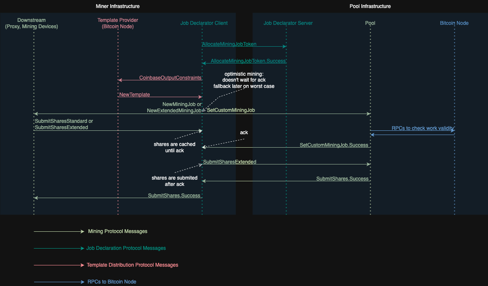
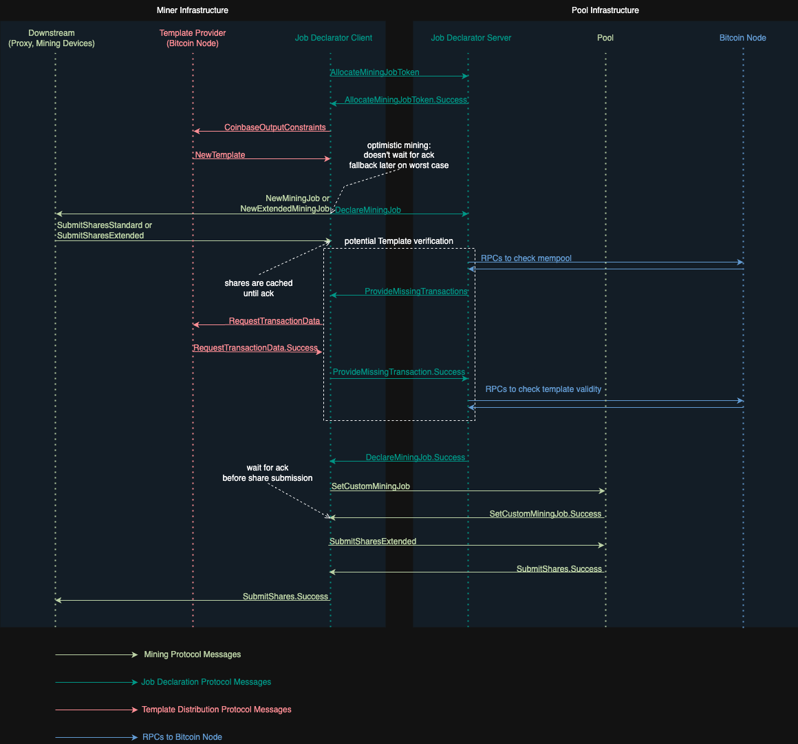

# 6. Job Declaration Protocol

The Job Declaration Protocol is used to coordinate the creation of custom work, avoiding scenarios where Pools are unilaterally imposing work on miners.

Pools that opt into this protocol are only responsible for accounting shares and distributing rewards.

This is a key feature of Stratum V2 that improves Bitcoin decentralization.

## 6.1 Job Declarator Server

The Job Declarator Server (JDS) is deployed on Pool side, although it could be theoretically outsourced to a third party that is trusted by the Pool.

In order to fully implement the Server side of the Job Declaration Protocol, the JDS also needs to exchange RPCs (or similar) with a Bitcoin Node. 

It is responsible for:
- Allocating tokens that JDC will use to declare Custom Jobs.
- Acknowledging declaration of Custom Jobs associated with specific allocated tokens.
- Maintaining an internal mempool (via RPCs (or similar) to a Bitcoin Node).
- Requesting missing transactions on some declared Custom Job (only under Full-Template mode).
- Publishing valid block submissions received from JDC.

## 6.2 Job Declarator Client

The Job Declarator Client (JDC) is deployed on the miner side.

In order to fully implement the Client side of the Job Declaration Protocol, the JDC also needs to operate under the Template Distribution and Mining Protocols.

It is responsible for:
- Receiving Templates from the Template Provider (via Template Distribution Protocol).
- Declaring Custom Jobs to JDS (via Job Declaration Protocol under Full-Template mode).
- Notifying declared Custom Jobs to Pool (via Mining Protocol).
- Receiving Shares from downstream Mining Devices working on Custom Jobs (via Mining Protocol).
- Submitting Shares for Custom Jobs to Pool.
- Publishing valid blocks found by downstream Mining Devices (both to Template Provider (TP) and JDS).

Additionally, if:
- JDS fails to respond with an `AllocateMiningJobToken.Success` in a reasonable time.
- JDS rejects some Custom Job declaration via `DeclareMiningJob.Error`.
- Pool rejects valid shares under a Custom Job that was previously acknowledged via `SetCustomMiningJob.Success` and/or `DeclareMiningJob.Success`.

JDC is also responsible for switching to a new Pool+JDS (or solo mining as a last resort).

This fallback strategy incentivizes honesty on Pool side, otherwise it will lose hashrate by rejecting Shares for a Custom Job that was already acknowledged to be valid. It also allows the miner to never stop mining on their preferred templates.

## 6.3 Job Declaration Modes

### 6.3.1 Coinbase-only Mode

Under Coinbase-only mode:
- JDS allocates `mining_job_token` to JDC (`AllocateMiningJobToken` / `AllocateMiningJobToken.Success`).
- Pool evaluates fee revenue of some proposed work (uniquely identified by `mining_job_token`) by looking at the coinbase.
- JDC never reveals the tx data contained in the template (in other words, the transaction set).
- proposed work is acknowledged as valid by Pool via `SetCustomMiningJob.Success`.
- the `DeclareMiningJob` message is never used.
- if a valid block is found, JDC propagates it unilaterally.

In other words, Pool + JDS operating under Coinbase-only mode do not require to ever know which transactions are included in the miner template, preserving the privacy around the miner's mempool.

This leaves Pool arguably vulnerable to an attack where miner declares a coinbase with some fee revenue while one of the following situations is true:
- the template actually has a different fee revenue.
- the template has invalid transactions.

This potential attack vector is in many ways identical to block withholding and defenses against block withholding generally apply.

Some pools may wish to utilize additional mitigations. For example, Zero-Knowledge-Proof based protocol extensions, where JDC proves that the fee revenue on the coinbase belongs to a valid template, without ever revealing the template itself.

As soon as JDC has:
- a token (allocated by JDS), so it can use it to identify some unique work that it wants to advertise
- a new template

It SHOULD start sending the jobs downstream for hashing right away. The proof-of-work (shares) SHOULD be cached until JDC receives an acknowledgement via `SetCustomMiningJob.Success`.

We call this **optimistic mining**.

### 6.3.2 Full-Template Mode

Under Full-Template mode:
- JDS allocates `mining_job_token` to JDC (`AllocateMiningJobToken` / `AllocateMiningJobToken.Success`).
- JDC sends `DeclareMiningJob` to JDS (containing the `txid` of every transaction in the template).
- JDS could potentially request for JDC to reveal `txdata` (via `ProvideMissingTransactions`).
- JDS acknowledges proposed work via `DeclareMiningJob.Success`.
- JDC notifies work to Pool via `SetCustomMiningJob`, acknowledged via `SetCustomMiningJob.Success`.
- if a valid block is found, both JDC and JDS propagate it.

Similarly to Coinbase-only, as soon as JDC has:
- a token (allocated by JDS), so it can use it to identify some unique work that it wants to advertise
- a new template

It SHOULD do optimistic mining by sending the jobs downstream for hashing right away. The proof-of-work (shares) SHOULD be cached until JDC receives an acknowledgement via `SetCustomMiningJob.Success`.

### 6.3.3 Coinbase-only vs Full-Template

The table below shows a comparison between the two Sv2 Job Declation Modes:

|                                     | Coinbase-only | Full-Template |
|-------------------------------------|-|-|
| knowledge of fee revenue            | • JDC   • Pool (while blind against tx data) | • JDC   • Pool (while blind against tx data)   • JDS (verifying against revealed tx data on behalf of Pool) |
| knowledge of txdata on the template | • JDC | • JDC   • JDS (on behalf of Pool) |
| ability to broadcast mined block    | • JDC | • JDC   • JDS (on behalf of Pool) |

## 6.4 Job Declaration Protocol Messages

### 6.4.1 `SetupConnection` Flags for Job Declaration Protocol

Flags usable in `SetupConnection.flags` and `SetupConnection.Error::flags`:

| Field Name                | Bit | Description                                                                                                                                                                                                                                                                                                                                                          |
| ------------------------- | --- | -------------------------------------------------------------------------------------------------------------------------------------------------------------------------------------------------------------------------------------------------------------------------------------------------------------------------------------------------------------------- |
| DECLARE_TX_DATA | 0   | JDC agrees to reveal the template's txdata via `DeclareMiningJob` and `ProvideMissingTransactions`. |

No flags are yet defined for use in `SetupConnection.Success`.

### 6.4.2 `AllocateMiningJobToken` (JDC -> JDS)

A request to get an identifier for a future-submitted mining job.
Rate limited to a rather slow rate and only available on connections where this has been negotiated. Otherwise, only `mining_job_token(s)` from `AllocateMiningJobToken.Success` are valid.

| Field Name      | Data Type | Description                                                                                                                                                                                                                        |
| --------------- | --------- | ---------------------------------------------------------------------------------------------------------------------------------------------------------------------------------------------------------------------------------- |
| user_identifier | STR0_255  | Unconstrained sequence of bytes. Whatever is needed by the pool to identify/authenticate the client, e.g. "braiinstest". Additional restrictions can be imposed by the pool. It is highly recommended that UTF-8 encoding is used. |
| request_id      | U32       | Unique identifier for pairing the response                                                                                                                                                                                         |

### 6.4.3 `AllocateMiningJobToken.Success` (Server -> Client)

The Server MUST NOT change the value of `coinbase_output_max_additional_size` in `AllocateMiningJobToken.Success` messages unless required for changes to the pool’s configuration.
Notably, if the pool intends to change the space it requires for coinbase transaction outputs regularly, it should simply prefer to use the maximum of all such output sizes as the `coinbase_output_max_additional_size` value.

| Field Name                          | Data Type | Description                                                                                                                                                                                                                                                                                                                                                              |
| ----------------------------------- | --------- | ------------------------------------------------------------------------------------------------------------------------------------------------------------------------------------------------------------------------------------------------------------------------------------------------------------------------------------------------------------------------ |
| request_id                          | U32       | Unique identifier for pairing the response                                                                                                                                                                                                                                                                                                                               |
| mining_job_token                    | B0_255    | Token that makes the client eligible for committing a mining job for approval/transaction declaration or for identifying custom mining job on mining connection.                                                                                                                                                                                                         |
| coinbase_tx_outputs         | B0_64K         | Bitcoin transaction outputs added by the pool. CompactSize‑prefixed array of consensus‑serialized outputs.                                                                          |

The following rules apply to `AllocateMiningJobToken.Success.coinbase_tx_outputs`:
- JDS MUST reserve the **first** output with a locking script where the pool payout will go. While this output is initally set with a 0 amount of sats, this convention designates this locking script as the **pool payout output**.
- JDS MAY add more 0 value outputs in addition to the pool payout output.

Once JDC receives `AllocateMiningJobToken.Success`, the following rules apply to the subsequent `DeclareMiningJob.coinbase_tx_suffix` (if under Full-Template mode) and `SetCustomMiningJob.coinbase_tx_outputs` (under both Full-Template and Coinbase-only modes) message fields:
- JDC MUST allocate sats into the pool payout output in order to qualify for pooled mining rewards. JDS and Pool SHOULD reject custom jobs that fail to do so.
- JDC MAY add more 0 value outputs in addition to the ones established by JDS.
- JDC MAY add more non-0 value outputs in addition to the ones established by JDS. In doing so, the template revenue is not fully allocated to the designated pool payout output, so Pool MAY pay proportionally smaller rewards for this job.
- JDC MAY arbitrarily reorder the outputs to something different from the original ordering of `AllocateMiningJobToken.Success.coinbase_tx_outputs`.
- Under Full-Template mode, the order of the outputs under `DeclareMiningJob.coinbase_tx_suffix` and `SetCustomMiningJob.coinbase_tx_outputs` MUST remain the same, even if they differ from the original `AllocateMiningJobToken.Success.coinbase_tx_outputs`.

In summary, the pool payout goes to one single output (standardized as the first output of `AllocateMiningJobToken.Success.coinbase_tx_outputs`), and JDC is free to add more outputs and shuffle them under any arbitrary ordering scheme.

Here's a few examples for clarification:

#### Example A

Example A illustrates JDS and JDC adding arbitrary 0 valued outputs in addition to the pool payout output.

Outputs in `AllocateMiningJobToken.Success.coinbase_tx_outputs`:
| Script      | Amount (sats)    | Description                                                       |
|-------------|------------------|-------------------------------------------------------------------|
| P2WPKH      | 0                | pool payout output                                                |
| OP_RETURN X | 0                | arbitrary unspendable output imposed by JDS                       |
| OP_RETURN Y | 0                | arbitrary unspendable output imposed by JDS                       |

Outputs in `DeclareMiningJob.coinbase_tx_suffix` and/or `SetCustomMiningJob.coinbase_tx_outputs`:
| Script      | Amount (sats)    | Description                                                       |
|-------------|------------------|-------------------------------------------------------------------|
| OP_RETURN Z | 0                | arbitrary unspendable output added by JDC                         |
| P2WPKH      | template_revenue | pool payout output                                                |
| OP_RETURN X | 0                | arbitrary unspendable output imposed by JDS                       |
| OP_RETURN Y | 0                | arbitrary unspendable output imposed by JDS                       |
| OP_RETURN W | 0                | SegWit commitment added by Template Provider                      |

#### Example B

Example B illustrates JDC allocating part of the template revenue to some outputs that are not the pool payout. Here, the Pool MAY pay proportionally smaller rewards for this custom job, since the template revenue is not fully allocated to the pool payout output.

Ordered outputs in `AllocateMiningJobToken.Success.coinbase_tx_outputs`:
| Script    | Amount (sats)    | Description                                         |
|-----------|------------------|-----------------------------------------------------|
| P2TR      | 0                | pool payout output                                  |

Ordered outputs in `DeclareMiningJob.coinbase_tx_suffix` and/or `SetCustomMiningJob.coinbase_tx_outputs`:
| Script    | Amount (sats)            | Description                                         |
|-----------|--------------------------|-----------------------------------------------------|
| P2PKH     | X                        | arbitrary output added by JDC                       |
| P2WSH     | Y                        | arbitrary output added by JDC                       |
| P2TR      | template_revenue - X - Y | pool payout output                                  |
| OP_RETURN | 0                        | SegWit commitment added by Template Provider        |

### 6.4.4 `DeclareMiningJob` (Client -> Server)

Only used in Full-Template mode.

A request sent by JDC that proposes a selected set of transactions to JDS.

| Field Name                  | Data Type             | Description                                                                                                                                                                                                                                                                                                                                                                                                                  |
| --------------------------- | --------------------- | ---------------------------------------------------------------------------------------------------------------------------------------------------------------------------------------------------------------------------------------------------------------------------------------------------------------------------------------------------------------------------------------------------------------------------- |
| request_id                  | U32                   | Unique identifier for pairing the response                                                                                                                                                                                                                                                                                                                                                                                   |
| mining_job_token            | B0_255                | Previously reserved mining job token received by AllocateMiningJobToken.Success                                                                                                                                                                                                                                                                                                                                              |
| version                     | U32                   | Version header field. To be later modified by BIP320-consistent changes.                                                                                                                                                                                                                                                                                                                                                     |
| coinbase_tx_prefix         | B0_64K                 | Serialized bytes representing the initial part of the coinbase transaction (not including extranonce)                                                                                                                                                                                                                                                                                                                                                                                      |
| coinbase_tx_suffix         | B0_64K                 | Serialized bytes representing the final part of the coinbase transaction (after extranonce)                                                                                                                                                                                                                                                                                     |
| wtxid_list               | SEQ0_64K[U256] | List of wtxids of the transaction set contained in the template. JDS checks the list against its mempool and requests missing txs via `ProvideMissingTransactions`. Does not include the coinbase transaction (as there is no corresponding full data for it yet).                                                                                                                                                          |
| excess_data                 | B0_64K                | Extra data which the Pool may require to validate the work (as defined in the Template Distribution Protocol)                                                                                                                                                                                                                                                                                                                |

\*Differently from `NewExtendedMiningJob`, if the original coinbase is a SegWit transaction, `coinbase_tx_prefix` and `coinbase_tx_suffix` MUST NOT be stripped of BIP141 fields (marker, flag, witness count, witness length and witness reserved value).

### 6.4.5 `DeclareMiningJob.Success` (Server -> Client)

A response sent by JDS acknowledging some Custom Job declaration.

JDS MAY request txdata via `ProvideMissingTransactions` before making this commitment.

Since JDS could be third party (not necessarily integrated to Pool), `DeclareMiningJob.Success.new_mining_job_token` MAY carry a cryptographic commitment from JDS where:
- JDS acknowledges that the template declared under `DeclareMiningJob.mining_job_token` is valid
- it signals to JDC that it should use `SetCustomMininingJob.mining_job_token = DeclareMiningJob.Success.new_mining_job_token` when declaring Custom Jobs to Pool as a way to prove it went through the Full-Template declaration process

| Field Name           | Data Type | Description                         |
| -------------------- | --------- |-------------------------------------|
| request_id           | U32       | Identifier of the original request. |
| new_mining_job_token | B0_255    | Unique custom work identifier.      |

### 6.4.6 `DeclareMiningJob.Error` (Server->Client)

A response sent by JDS rejecting some Custom Job declaration.

This should be a trigger for fallback into some other Pool+JDS or solo mining.

| Field Name    | Data Type | Description                                            |
| ------------- | --------- | ------------------------------------------------------ |
| request_id    | U32       | Identifier of the original request                     |
| error_code    | STR0_255  |                                                        |
| error_details | B0_64K    | Optional data providing further details to given error |

Possible error codes:

- `invalid-mining-job-token`
- `invalid-job-param-value-{}` - `{}` is replaced by a particular field name from `DeclareMiningJob` message

### 6.4.7 `ProvideMissingTransactions` (Server->Client)

Only used in Full-Template mode.

If `DeclareMiningJob` includes some transactions that JDS's mempool has not yet seen, then JDS needs to request that JDC provides those missing ones.

| Field Name               | Data Type     | Description                                                                                                                                                                                                                              |
| ------------------------ | ------------- | ---------------------------------------------------------------------------------------------------------------------------------------------------------------------------------------------------------------------------------------- |
| request_id               | U32           | Identifier of the original AllocateMiningJobToken request                                                                                                                                                                                |
| unknown_tx_position_list | SEQ0_64K[U16] | A list of unrecognized transactions that need to be supplied by the Job Declarator in full. They are specified by their position in the original DeclareMiningJob message, 0-indexed not including the coinbase transaction transaction. |

### 6.4.8 `ProvideMissingTransactions.Success` (Client->Server)
This is a message to push transactions that the server did not recognize and requested them to be supplied in `ProvideMissingTransactions`.

| Field Name       | Data Type        | Description                                                                                                                          |
| ---------------- | ---------------- | ------------------------------------------------------------------------------------------------------------------------------------ |
| request_id       | U32              | Identifier of the original  AllocateMiningJobToken request                                                                           ""|
| transaction_list | SEQ0_64K[B0_16M] | List of full transactions as requested by ProvideMissingTransactions, in the order they were requested in ProvideMissingTransactions |

### 6.4.9 `PushSolution` (Client -> Server)

Only used in Full-Template mode.

Sent by JDC as soon as a valid block is found, so that it can be propagated also by JDS.

In the meantime, the block is also transmitted to the network by JDC through the `SubmitSolution` message under in Template Distribution Protocol.

In this way, a valid solution is immediately propagated on both client and server sides, decreasing the chance of the block being orphaned by the network.

| Field Name                              | Data Type | Description                                                                                                                                                                                                                                                                                |
| --------------------------------------- | --------- | ------------------------------------------------------------------------------------------------------------------------------------------------------------------------------------------------------------------------------------------------------------------------------------------ |
| extranonce                              | B0_32     | Extranonce bytes which need to be added to coinbase to form a fully valid submission.  (This is the full extranonce)                 |
| prev hash                               | U256      | Hash of the last block                                                                                  |
| nonce                                   | U32       | Nonce leading to the hash being submitted                                                               |
| ntime                                   | U32       | The nTime field in the block header.                                                                    |
| nbits                                   | U32       | The nBits field in the block header.                                                                    |
| version                                 | U32       | Version header field.                                                                                   |
