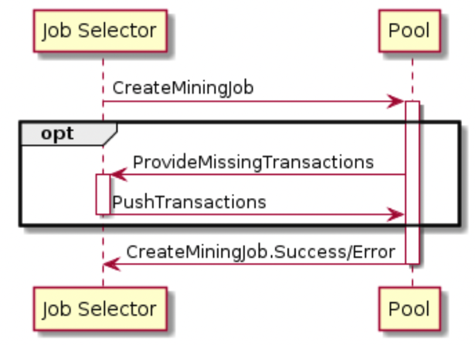

# 6. Job Negotiation Protocol
As outlined above, this protocol runs between the Job Negotiator and Pool and can be provided as a trusted 3rd party service for mining farms.

Protocol flow:

  
Figure 5.a Job Negotiation Protocol: Flow


## 6.1 Job Negotiation Protocol Messages


### 6.1.1 `SetupConnection` Flags for Job Negotiation Protocol

The Job Negotiation Protocol's messages will be changed with the consensus of developers, pools, and community feedback. 

These changes will allow the JN proxy to establish an ExtendedWithNegotiator channel with the pool after a successful SetupConnection. The pool will then send a SetCoinbase message with coinbase_output_max_additional_size data to the Template Provider, which will respond with a NewTemplate and SetNewPrevash message. 
These messages will be sent by the JN proxy to the Mining Proxy to build new jobs for the mining devices through the Mining Protocol. 

All other messages will be removed since there will not be needed any verification on the current or future templates by the pool wwich will just receive shares related to the coinbase sent previously.

DRAFT: Additionally, a set of messages related to the SanityCheck message from the JN proxy will be created to allow the pool to verify that the miner received the correct template and to decide the repartition of fees in case they are not aligned with a corresponding template that may have had more fees.

Flags usable in `SetupConnection.flags` and `SetupConnection.Error::flags`:

```
+---------------------------+-----+------------------------------------------------------------------------------------+
| Field Name                | Bit | Description                                                                        |
+---------------------------+-----+------------------------------------------------------------------------------------+
| REQUIRES_ASYNC_JOB_MINING | 0   | The Job Negotiator requires that the mining_job_token in                           |
|                           |     | AllocateMiningJobToken.Success can be used immediately on a mining connection in   |
|                           |     | SetCustomMiningJob message, even before CommitMiningJob and                        |
|                           |     | CommitMiningJob.Success messages have been sent and received.                      |
|                           |     | The server MUST only send AllocateMiningJobToken.Success messages with             |
|                           |     | async_mining_allowed set.                                                          |
+---------------------------+-----+------------------------------------------------------------------------------------+
```

### 6.1.2 `SetupConnection.Success` (Server -> Client)

No flags are yet defined for use in SetupConnection.Success.

### 6.1.3 `SetCoinbase` (Server -> Client)
 Ultimately, the pool is responsible for adding coinbase transaction outputs for payouts and
 other uses, and thus the Template Provider will need to consider this additional block size
 when selecting transactions for inclusion in a block (to not create an invalid, oversized block).
 Thus, this message is used to indicate that some additional space in the block/coinbase
 transaction be reserved for the pool’s use (while always assuming the pool will use the entirety
 of available coinbase space).
 The Job Negotiator MUST discover the maximum serialized size of the additional outputs which
 will be added by the pool(s) it intends to use this work. It then MUST communicate the
 maximum such size to the Template Provider via this message. The Template Provider MUST
 NOT provide NewWork messages which would represent consensus-invalid blocks once this
 additional size — along with a maximally-sized (100 byte) coinbase field — is added. Further,
 the Template Provider MUST consider the maximum additional bytes required in the output
 count variable-length integer in the coinbase transaction when complying with the size limits.
```
+-------------------------------------+-----------+--------------------------------------------------------------------+
| Field Name                          | Data Type | Description                                                        |
+-------------------------------------+-----------+--------------------------------------------------------------------+
| coinbase_output_max_additional_size | U32       | The maximum additional serialized bytes which the pool will add in |     
|                                     |           | coinbase transaction outputs.                                      |
|                                     |           | This can be extrapoleted from the below fields but for             |
|                                     |           | convenince is here.                                                |
+-------------------------------------+-----------+--------------------------------------------------------------------+
| token                               | U64       | Token valid for the below coinbase. When a downstream send a       |
|                                     |           | SetCostumMiningJob the pool check if the token match a valid       |
|                                     |           | coinbase if so it respond with SetCostumMiningJob.Success          |
+-------------------------------------+-----------+--------------------------------------------------------------------+
| coinbase_tx_prefix                  | BOOL      | Prefix part of the coinbase transaction                            |
+-------------------------------------+-----------+--------------------------------------------------------------------+
| coinbase_tx_suffix                  | B0_255    | Suffix part of the coinbase transaction.                           |
+-------------------------------------+-----------+--------------------------------------------------------------------+
```