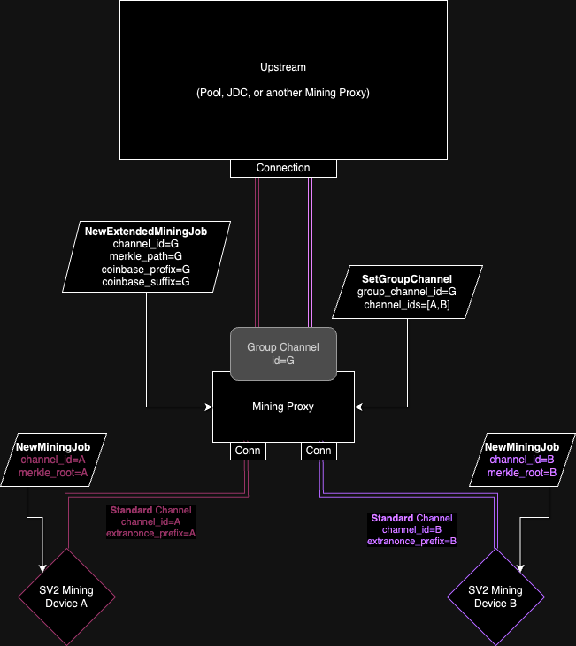

## 11 Proxies

Proxies are entities that aggregate hashrate from multiple Mining Devices into a single Connection.

The following protocol primitives are based on the assumption that proxies are part of the infrastructure:
- Extended Extranonces: allowing for efficient hashing space distribution.
- Future Jobs: allowing for in-site caching of Future Jobs (therefore avoiding empty Jobs).

Proxies can be nested into multiple layers, depending on different needs for miner infrastructure.
The infrastructure complexity may vary according to operational requirements, but a single proxy layer should suffice for most simple setups.

Proxies can be split in two main categories:

### 11.1 Mining Proxy

TODO: review correctness of this

A Mining Proxy covers the full scope of the Mining Protocol. It supports all types of channels, both for Upstream and Downstream Connections.

|                | **Standard Channels** | **Group Channels** | **Extended Channels** |
|----------------|-----------------------|--------------------|-----------------------|
| **Upstream**   | yes                   | yes                | yes                   |
| **Downstream** | yes                   | yes                | yes                   |

A Mining Proxy is responsible for delivering Jobs to Downstream Channels and is a crucial piece of infrastructure for optimizing the hash space distribution across multiple SV2 Mining Devices (plus SV1 Mining Devices, in case a Translator Proxy is available Downstream).

A Mining Proxy can forward multiple Standard Channels to the Upstream, ideally one representing each SV2 Mining Device Downstream.
The Upstream (Pool, JDC or another Mining Proxy) is expected to send a `SetGroupChannel` message aggregating different Standard Channels.
The Upstream sends jobs via `NewExtendedMiningJob` to Group Channels, and if some Downstream is a Mining Device (i.e.: the `SetupConnection` had the `REQUIRES_STANDARD_JOBS` flag) the Mining Proxy converts that message into different `NewMiningJob` messages after calculating the correct Merkle Root based on each Standard Channel's `extranonce_prefix`.

Alternatively, a Mining Proxy could aggregate multiple Donwstream Standard Channels into a single Extended Channel. The Upstream sends Jobs via `NewExtendedMiningJob`, and for each Downstream SV2 Mining Device, the Mining Proxy sends different `NewMiningJob` message, where the Merkle Root is based on the Standard Channel's `extranonce_prefix`.

 

### 11.2 Translator Proxy

A Translator Proxy has a much more limited scope of functionality, when compared to a Mining Proxy.
It can only open Extended Channels with its Upstream, and all its Downstream Connections are SV1.

Its main purpose is to allow legacy SV1 Mining Devices to be deployed within SV2 infrastructures.

|                | **Standard Channels** | **Group Channels** | **Extended Channels** |
|----------------|-----------------------|--------------------|-----------------------|
| **Upstream**   | no                    | no                 | yes                   |
| **Downstream** | no (SV1)              | no (SV1)           | no (SV1)              |

A Translator Proxy establishes SV1 connections with its Downstream SV1 Mining Devices, and establishes `extranonce_size` and a unique `extranonce_prefix` for each one of them via the `mining.set_extranonce` SV1 message.

It receives Extended Jobs from the Upstream via `NewExtendedMiningJob` messages. For each Downstream SV1 Mining Device, a `mining.notify` SV1 message is sent, and the SV1 Mining Devices are expected to calculate their own Merkle Roots while rolling over their assigned Extranonce space.

